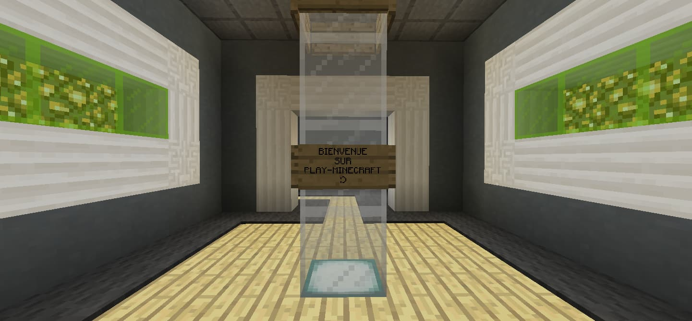
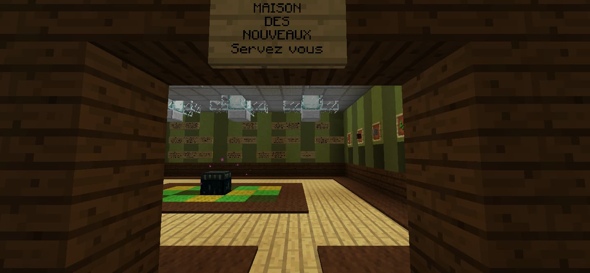
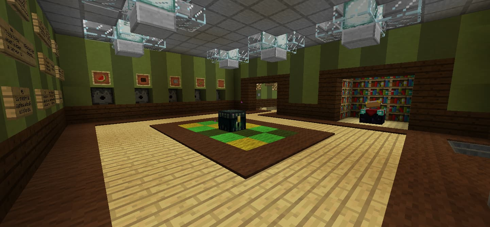

# Acquérir vos premières ressources

Après avoir pris en compte ces informations, vous vous connectez enfin et débarquez au spawn !

Nous allons désormais chercher le minimum requis pour votre début de survie !  
En effet, si votre barre de faim est vide, vous en mourrez !

Nous sommes ravis de vous annoncer la présence d'une maison des nouveaux joueurs !

Situé sous le spawn, ce bâtiment public propose une aide matérielle aux nouveaux joueurs du serveur.

Il regroupe actuellement quatre distributeurs pour les produits de première nécessité : Bois, Nourriture, Graines, Cobble.

Servez vous sans abuser des bonnes choses... Il en faut pour tout le monde !

De plus, des panneaux de rappel d'informations/règles sont également à votre disposition.

Une zone de dons est accessible dans le hall central. Faites nous parvenir du matériel pour les nouveaux, merci pour votre participation !

