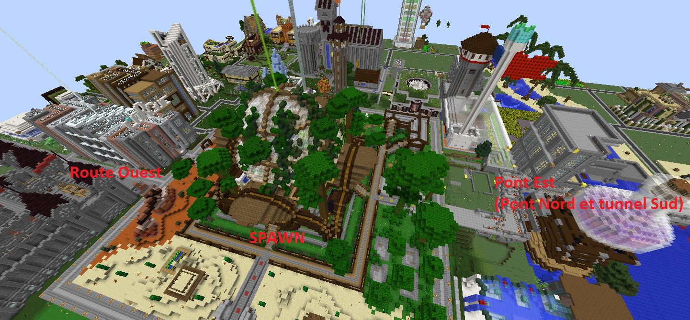
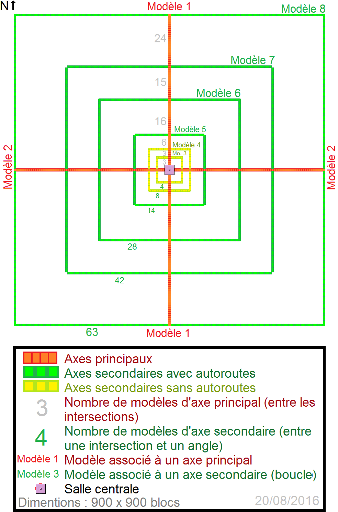

# Où vous installer

C'est bon ? Vous avez de quoi vous nourrir et un peu de bois pour débuter votre aventure ?  
Nous vous encourageons alors à poursuivre votre chemin.  
En effet le spawn étant très urbanisé il vous sera difficile d’y trouver un terrain libre et des ressources \(minières et naturelles\).

N’hésitez pas à repérer le terrain via la carte dynamique du serveur disponible ici : [Dynmap Survie](http://map.play-mc.fr/)

Un certain nombre de villes sont décrites sur le forum et pourront certainement vous accueillir, à voir [ici](http://play-mc.fr/forum/t/villes).

Si vous souhaitez vous installer en pleine nature, vous avez à disposition plusieurs axes pour vous éloigner : route Ouest, route Est, pont Nord et tunnel Sud.

Ou encore, pour les plus téméraires, les passages rapides via le nether.

Le nether est totalement aménagé et très sécurisé. Il s’étend selon un plan précis et certaines règles :

Vous pouvez trouver toutes les informations détaillées sur le fonctionnement du nether [ici](http://play-mc.fr/forum/d/292-organisation-du-nether).

