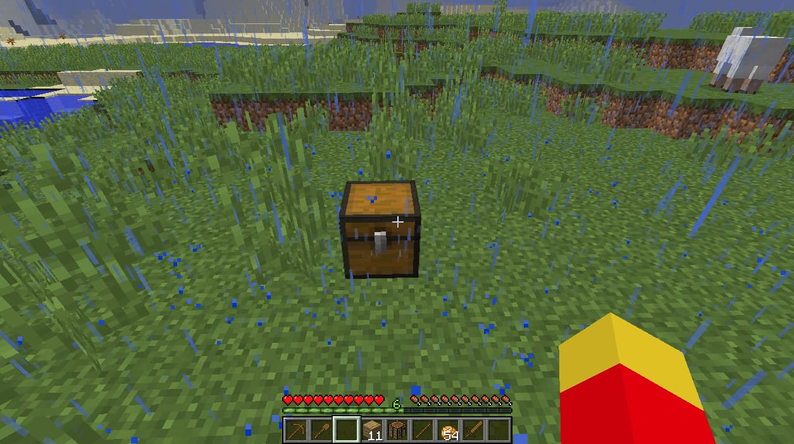

# Protéger votre terrain

## Protéger votre terrain :

Cette partie du tutoriel est disponible en vidéo \(réalisée par le joueur ClemW\), vous en avez de la chance !



Et si vous préférez lire, c'est par ici :

## Le claim :

Une zone protégée est appelée « claim ».

Nous utilisons un plugin de protection assez simple, mais qui demande un petit temps d'adaptation : GriefPrevention.

Plus vous jouez sur le serveur, plus vous pourrez protéger de blocs. \(+ 100 blocs par heure\) Une fois posé, des blocs d'or apparaîtront, ces derniers délimitent votre zone protégée :

Les deux outils dont vous aurez besoin ensuite sont : un bâton en bois et une pelle en or. Faites un clic droit avec le bâton en bois sur le sol pour inspecter. Si la zone est protégée, vous verrez les blocs d'or pour délimiter la zone ainsi qu'un texte vous donnant le nom du propriétaire.

La pelle en or sert à redimensionner une zone protégée :

Mais encore, prendre votre pelle « en main » vous indiquera le nombre de blocs disponibles pour vos claims futurs.

## La protection :

La protection du claim est effective de 5 blocs sous le coffre jusqu'au ciel. Celle-ci s’étend automatiquement vers le bas lorsque vous creusez dans votre claim et posez un bloc au fond. Vous pouvez évidemment vérifier à chaque instant la protection avec un bâton.

### Par défaut, dans vos zones, un joueur ne pourra pas :

* Détruire et/ou brûler les blocs d’une manière ou d’une autre.
* Ouvrir les coffres, fournaises, tables de craft, stands d’alchimie, tables d’enchantement, portillons…
* Utiliser les boutons et les leviers.
* Tuer, tondre vos animaux.
* Récupérer l’eau.
* Saccager ou récolter vos plantes.
* Inonder, remplir de lave et exploser votre zone.

### Mais il pourra :

* Ouvrir vos portes en bois et vos trappes.
* Utiliser les plaques de pression \(ainsi que les boutons en bois à l'aide d'un arc\).
* Marcher dans votre zone.
* Attirer vos animaux hors de votre zone.

## Les commandes spécifiques:

Voici une petite liste de commandes possibles pour vos claims:

* `/AbandonClaim` : Supprime la zone protégée sur laquelle vous êtes 
* `/AbandonAllClaims` : Supprime toutes vos zones protégées 
* `/Trust [pseudo]` : Permet de donner les permissions à un autre joueur 
* `/Untrust [pseudo]` : Retire les permissions 
* `/Accesstrust [pseudo]` : Donne la permission d'utiliser les boutons, leviers et lits 
* `/ContainerTrust [pseudo]` : Donne l'accès aux coffres, aux animaux, aux établis 
* `/TrustList` : Liste les permissions pour la zone sur laquelle vous êtes 
* `/Permissiontrust [pseudo]` : Donne le droit à un joueur d'utiliser les commandes ci-dessus sur votre parcelle : à utiliser avec précautions

Des précisions sur les autorisations et subdivide-claims, par HellOfDevil, sont disponibles [ici](https://play-mc.fr/forum/d/147-digressions-sur-les-claims-et-sous-claims).

Maintenant que votre zone est protégée, vous pouvez y construire votre maison en toute sécurité.

## Retrouver votre maison :

Pensez à utiliser la commande `/sethome` pour définir un « chez soi » et vous donner l’opportunité de vous téléporter à cet endroit avec la commande `/home`.

Attention, l’utilisation du `/home` est bridée à une fois par demi-heure. De plus, notez qu’il n’existe pas de commande `/spawn` ou encore `/warp` par exemple.

## Commandes utiles :

* `/t [pseudo] [message]` : Envoie un message privé à un joueur. \(fonctionne aussi avec : /w /msg /m\) 
* `/r` : Répond au dernier message privé. 
* `/helpop [message]` : Demandez l'assistance des modérateurs en ligne actuellement. 
* `/list` : Liste des joueurs en ligne. 
* `/mail send [destinataire] [message]` : Envoie un mail à un joueur. Il pourra le lire plus tard et sera averti lors de sa prochaine connexion. \(contrairement aux messages privés\) 
* `/suicide` : Vous téléporte au spawn, mais vous perdez évidemment inventaire et niveaux d'expérience.

